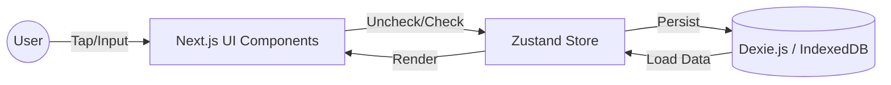

# 技術選定書 (Technology Selection)

## 1. プロジェクト概要
`mvp.md`に基づく習慣化アプリの開発を行います。本アプリは「責めない・考えさせないUI」を掲げ、ユーザーの継続率を最優先した設計となります。

- **必須要件 (P0)**: 月次グリッド表示、1タップ記録、ローカル永続化（オフライン動作）。
- **将来要件 (P1/Paid)**: クラウド同期、機種変更時の復元。

## 2. 技術スタック選定

MVP（Minimum Viable Product）および将来の拡張性を見据え、以下の技術スタックを選定しました。

| カテゴリ             | 選定技術                  | 選定理由・採用意図                                                                                                                                                                                  |
| :------------------- | :------------------------ | :-------------------------------------------------------------------------------------------------------------------------------------------------------------------------------------------------- |
| **Framework**        | **Next.js (App Router)**  | SSR/SSGの柔軟性、将来的なAPI Routesによるバックエンド機能（クラウド同期等）の統合が容易。`next-pwa`等を用いることでPWA（Progressive Web App）としてモバイルアプリに近いUXを提供可能。               |
| **Language**         | **TypeScript**            | 型安全性によるバグ抑制と、長期的な保守性の確保。                                                                                                                                                    |
| **UI Library**       | **React**                 | 一般的かつ強力なコンポーネント指向UIライブラリ。エコシステムが成熟している。                                                                                                                        |
| **Styling**          | **Tailwind CSS**          | ユーティリティファーストによる迅速なスタイリング。デザイン変更への柔軟な対応。                                                                                                                      |
| **UI Components**    | **shadcn/ui**             | Radix UIベースのアクセシビリティ対応済みコンポーネント。コピー&ペースト型でカスタマイズ性が高く、プレミアムな独自デザインを実現しやすい。                                                           |
| **Animation**        | **Framer Motion**         | 「1タップチェック」の成功体験を高めるリッチなマイクロインタラクションや、画面遷移時のスムーズなアニメーション実装のため。                                                                           |
| **Local Storage**    | **Dexie.js (IndexedDB)**  | **最重要選定**。P0要件である「ローカル永続化」および「オフライン動作」を実現するため、ブラウザ標準のIndexedDBを扱いやすくラップしたDexie.jsを採用。パフォーマンスが高く、大量の履歴データも扱える。 |
| **State Management** | **Zustand**               | Reduxよりも軽量でボイラープレートが少なく、Hooksベースでシンプルに状態管理が可能。                                                                                                                  |
| **Date Library**     | **date-fns**              | 「今日」のハイライトや月次カレンダー生成など、日付操作が多用されるため。軽量でTree-shaking対応。                                                                                                    |
| **Test Runner**      | **Vitest**                | Viteベースで動作が高速。Next.js環境との親和性が高い。                                                                                                                                               |
| **Component Test**   | **React Testing Library** | ユーザー視点（アクセシビリティ対応）でのDOMテストが可能。                                                                                                                                           |
| **E2E Test**         | **Playwright**            | ブラウザ（特にMobile Viewport）での動作検証が容易。IndexedDBの永続化テストも書きやすい。                                                                                                            |

## 3. アーキテクチャ設計 (MVPフェーズ)

本フェーズでは**Local-First（ローカルファースト）**アーキテクチャを採用します。サーバーサイドへのデータ保存は行わず、全てのデータはユーザーのブラウザ（IndexedDB）内に保存されます。

### データフロー

### 特徴
1.  **オフライン完全動作**: ネットワーク接続に依存せず、いつでも即座に記録・閲覧が可能（「思考コスト削減」に寄与）。
2.  **プライバシー保護**: データは端末内に閉じているため、セキュアで安心。
3.  **高速なレスポンス**: サーバー通信のレイテンシがないため、タップ時の反応が極めて高速。

## 4. 将来の拡張計画 (Proプラン対応)

有料機能（クラウド同期、バックアップ）実装時の拡張イメージです。

- **Backend**: Supabase (PostgreSQL + Auth) または Firebase を想定。
- **Sync Strategy**:
    - ユーザーが「Proプラン」に加入後、ログイン（Auth）を行う。
    - Dexie.js の内容をクラウド（Supabase等）にプッシュ。
    - 以降、変更差分を同期するロジックを追加実装する。
    - Next.jsであれば、API Route経由またはClient SDK利用のどちらも柔軟に対応可能。

## 5. UI/UX デザイン方針 (技術的アプローチ)

- **グリッド表示**: CSS Gridを活用し、レスポンシブかつ高速に月次グリッドを描画。
- **ダークモード**: Tailwind CSSのDark Mode機能を標準サポート。
- **PWA**: ホーム画面に追加可能にし、ネイティブアプリのような起動感を実現。

## 6. まとめ

この構成により、MVPの最重要課題である「習慣化のハードルを下げる（サクサク動く、いつでも使える）」を技術面から強力にサポートしつつ、将来のマネタイズ機能追加にもスムーズに移行できる基盤を構築します。
